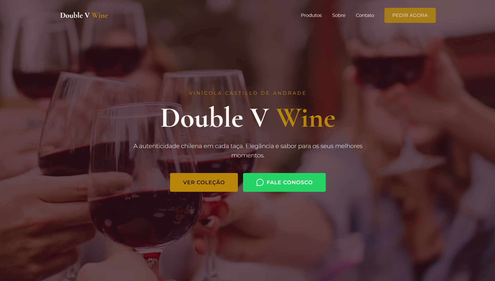

# 🍷 Double V Wine — Landing Page

Landing page moderna e responsiva desenvolvida para a marca de vinhos **Double V Wine**.

🔗 **Site ao vivo**: [doublevwine.com.br](https://doublevwine.com.br/)
📷 **Instagram da marca**: [@doublevwine](https://www.instagram.com/doublevwine/)

## 📸 Preview

## 💡 Sobre o projeto

Landing page criada para apresentar a marca, produtos e identidade visual da Double V Wine, com foco em design elegante, performance e responsividade para todos os dispositivos.

## 🛠️ Tecnologias utilizadas

- ⚡ **Vite** — build rápido e otimizado
- ⚛️ **React** + **TypeScript**
- 🎨 **Tailwind CSS** — estilização utilitária
- 🧩 **shadcn/ui** — componentes acessíveis e customizáveis

## ✨ Funcionalidades

- Design responsivo (mobile-first)
- Performance otimizada
- Identidade visual alinhada à marca

---

Desenvolvido por [Gabriel](https://github.com/gabrielaias) | [LinkedIn](https://www.linkedin.com/in/gabrielaias/)
